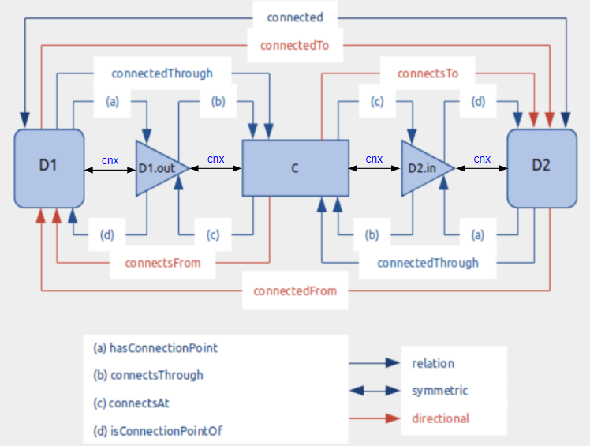
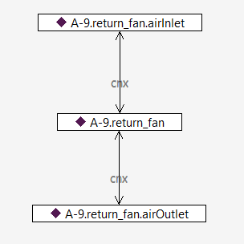
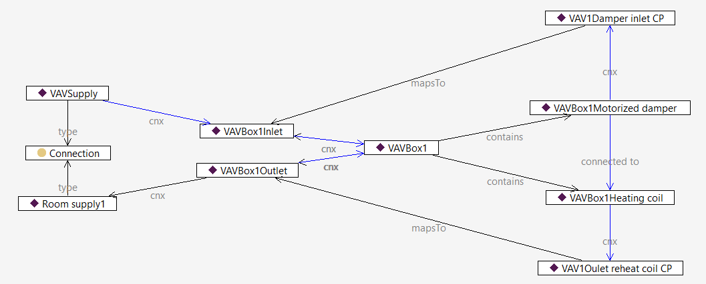
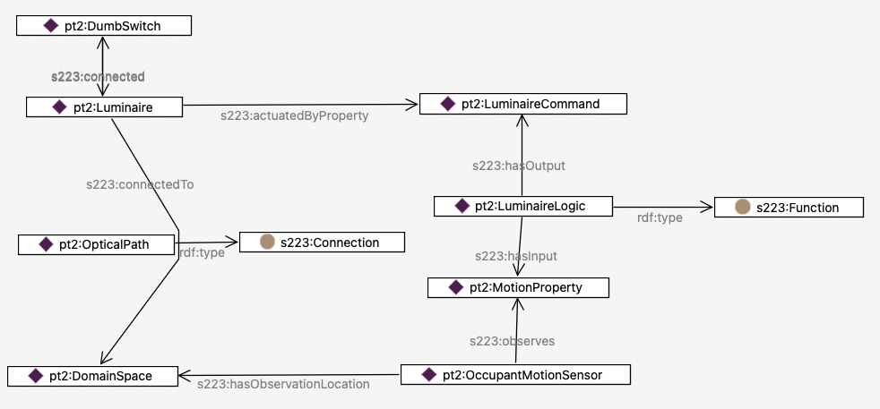
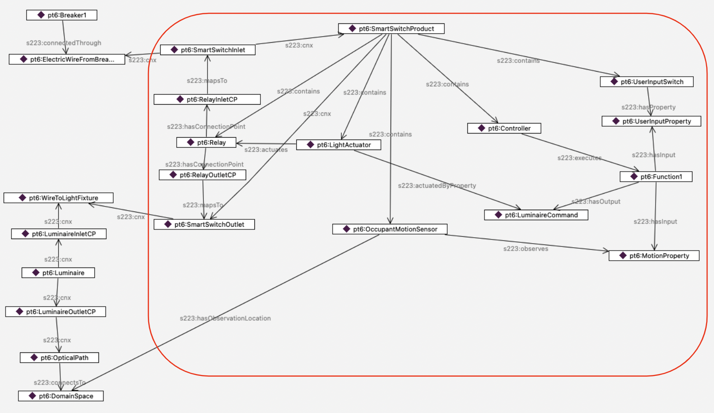

# Modeling Design Patterns

Several modeling tools, such as BuildingMOTIF and Bob, enable modelers to easily reuse design patterns in their models. Both of these tools have pre-existing templates that allow developers to model at a higher level. However, buildings are unique, and developers may need to model pieces of equipment that are not already represented in 223P model creation tools. Thus, this guide provides a step-by-step way to model core ideas in the standard.

This section guides developers on modeling connectivity and describing the topology between equipment. The topology diagram below illustrates various concepts and relations relevant to establishing connections. Building upon this general diagram, the following sections will detail incremental changes and provide examples to illustrate the progression of complexity. As shown in the topology diagram, predicates are defined at different levels of abstraction. This diagram demonstrates how various concepts in the standard describe connectivity between two Connectables. Some predicates are exclusive to connections between Connectable and ConnectionPoints, such as hasConnectionPoint, while others only apply between ConnectionPoints and Connections, like connectsAt. However, the generic "cnx" relation can describe connectivity between any concept involved, including Connectable, Connection, and ConnectionPoint. It's crucial to note that all other predicates can be inferred from the "cnx" predicate.

In this example, we demonstrate a straightforward use case: creating the initial element of a connection. This involves attaching the Connectable (Equipment) "A9.return-fan" to its inlet and outlet ConnectionPoints using the "cnx" relation.

The following scenario illustrates the connectivity between the equipment "A-9.return-fan" and "A-9.exhaust_air_damper." The "cnx" sequence originates from the equipment "A-9.return-fan," extends to its outlet connection point "A9.return-fan.airOutlet," and connects to the Connection "A-9.return-air" between the two pieces of equipment. It then continues to the neighboring equipment's inlet connection point "A-9.exhaust_air_damper.airInlet" The inferred relation in this graph is "connectedTo," which is a directional relation.

This next scenario builds upon the previous one and provides additional details about the inferred relations between different instances in this example. For instance, the "hasConnectionPoint" relation between "A-9.return-fan" and "A-9.return-fan.airOutlet" has been inferred based on the "cnx" relation between them. Similarly, the "connectsAt" relation has been established between "A-9.return-air" and "A-9.exhaust_air_damper.airInlet" based on the "cnx" relation between these entities.

This example describes the notation of containment in the standard. VAVBox1 contains two pieces of equipment: VAVBox1HeatingCoil and VAVBox1MotorizedDamper. Note that these two pieces of equipment are internally connected (as shown by the vertical purple line between them). Also, their connection points map to the inlet and outlet connection points of their container (VAVBox1) using the relation 'mapsTo.' This indicates that any incoming connection flow to VAVBox1 will lead to the damper, and any outgoing one will stem from the heating coil.

The next three examples showcase how Functions, as logical constructs, are implemented in the standard. The following example demonstrates how a luminaire can be controlled based on motion occupancy sensing. The Function labeled LuminaireLogic takes motion as an input property and provides the LuminaireCommand Property as the output, referred to by the luminaire via commandedByProperty. DumbSwitch simply provides power to the circuit.

The next case examines a scenario where the luminaire logic encapsulated in `Function1` takes a combination of inputs: the motion sensor property as before, and a UserSwitchProperty that is set by a smart switch. The function block uses this combination of inputs to determine whether the luminaire is turned on or off.

Finally, the next case pulls the concepts of containment, connectivity and function block together to model a motion-sensitive smart switch that a consumer might buy at a hardware store. The red rectangle delineates the consumer smart switch. The smart switch contains five elements: 
1. a relay,
2. a light actuator that activates the relay based on the property `LuminaireCommand`,
3. an occupant motion sensor that sets value of `MotionProperty`,
4. a controller that executes Function1 to set the value of the property `LuminaireCommand`, 
5. and a `UserInputSwitch` that sets the value of `UserInputProperty`. 

On the left of the diagram, you can see the modeling of the electricity that flows from Breaker1, to Relay, then on to the LightBulb. At that point, the medium (not shown) changes from electricity to visible light that flows from the LightBulb, through OpticalPath, to DomainSpace.

If all this detail seems overwhelming, remember that you don't need to model all the inner components of the smart switch if you don't want to. The entire model inside the red rectangle can be modeled as simply as shown below.

